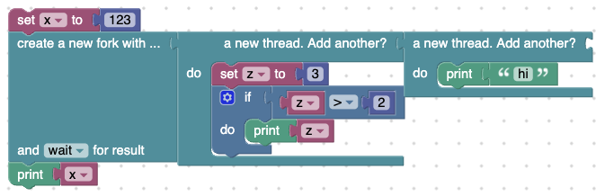

# Par-Blockly

A fork of Google's Blockly that supports parallel scheduling for blocks, and a code generation to Javascript.


```
npm install
npm run start
```

You can paste example json from [parallel_1.json](parallel_1.json), [parallel_2.json](parallel_2.json), and [parallel_3.json](parallel_3.json) and `Load` them into the Blockly editor.

## Examples

### Original (single process Blockly)


### Parallel (multi-process Blockly)

#### Asynchronous Execution


#### Synchroous Execution
